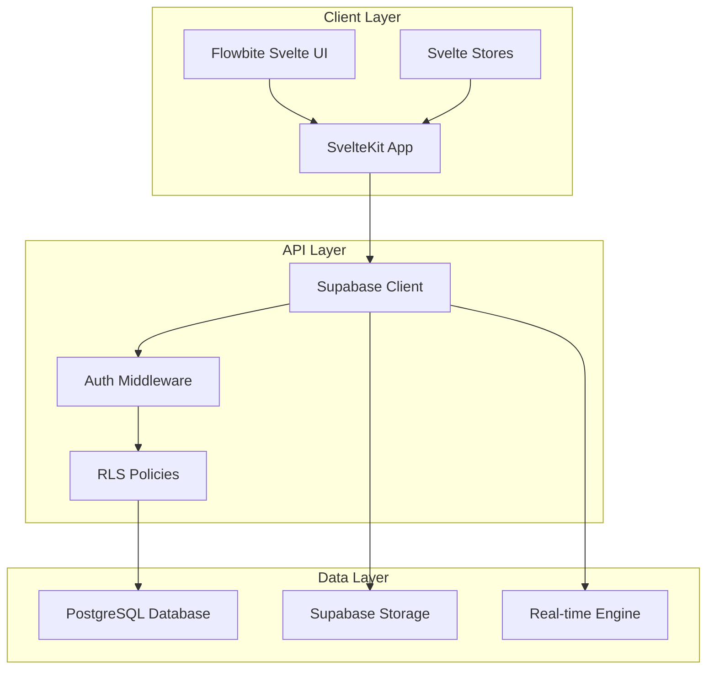

# Design Document

## Overview

The PartyFarm Booking Management Platform is a SvelteKit-based web application that provides dual dashboard interfaces for managing farmhouse bookings. The system leverages Supabase for authentication, database management, real-time updates, and file storage. The architecture emphasizes role-based access control, real-time synchronization, and conflict prevention to ensure seamless booking management.

## Architecture

### High-Level Architecture



### Technology Stack

- **Frontend:** SvelteKit with TypeScript
- **UI Framework:** Flowbite Svelte (Tailwind CSS based)
- **Backend:** Supabase (PostgreSQL + Auth + Storage + Real-time)
- **State Management:** Svelte stores
- **Authentication:** Supabase Auth with RLS
- **Deployment:** Vercel (frontend) + Supabase Cloud

### Route Structure

```
/
├── login/                  # Public login page (Google/Phone auth)
├── signup/                 # Public signup page
├── (auth)/                 # Auth-protected routes (requires login)
│   ├── inhouse/           # In-house user dashboard
│   │   ├── properties/    # Property management
│   │   ├── bookings/      # Booking management
│   │   ├── calendar/      # Calendar view
│   │   └── users/         # User management
│   ├── farmhouse/         # Farmhouse owner dashboard
│   │   ├── properties/    # My properties
│   │   ├── bookings/      # My bookings
│   │   ├── calendar/      # Availability management
│   │   └── staff/         # Staff management
│   └── profile/           # User profile settings
└── api/                   # API routes (if needed)
```

## Components and Interfaces

### Core Components

#### Authentication Components
- `GoogleLogin.svelte` - Google OAuth login button
- `PhoneLogin.svelte` - Phone number authentication with OTP
- `AuthChoice.svelte` - Choose between Google or Phone login
- `OTPVerification.svelte` - OTP input and verification
- `AuthGuard.svelte` - Route protection wrapper for (auth) routes
- `RoleGuard.svelte` - Role-based access control

#### Dashboard Components
- `DashboardLayout.svelte` - Main layout with navigation
- `Sidebar.svelte` - Role-based navigation menu
- `Header.svelte` - User profile and notifications
- `BreadcrumbNav.svelte` - Navigation breadcrumbs

#### Property Management Components
- `PropertyForm.svelte` - Create/edit property details
- `PropertyCard.svelte` - Property display card
- `PropertyList.svelte` - Property listing with filters
- `ImageUpload.svelte` - Multi-image upload component
- `LocationPicker.svelte` - Map-based location selection

#### Booking Management Components
- `BookingForm.svelte` - Create/edit booking
- `BookingCard.svelte` - Booking display card
- `BookingList.svelte` - Booking listing with filters
- `BookingStatus.svelte` - Status update component
- `CustomerDetails.svelte` - Customer information form

#### Calendar Components
- `CalendarView.svelte` - Main calendar interface
- `AvailabilityCalendar.svelte` - Property availability management
- `BookingCalendar.svelte` - Booking overview calendar
- `DatePicker.svelte` - Date selection component
- `PricingCalendar.svelte` - Dynamic pricing management
- `PricingConfigurator.svelte` - Setup tiered or flat pricing
- `PriceCalculator.svelte` - Real-time price calculation based on guests/dates
- `AmenitySelector.svelte` - Select and configure amenities for properties
- `AmenityPicker.svelte` - Select amenities during booking with price calculation

#### Payment Management Components
- `PaymentTracker.svelte` - Display payment history and status
- `PaymentForm.svelte` - Record new payments
- `PaymentSchedule.svelte` - Set advance/final payment schedule
- `PaymentSummary.svelte` - Payment overview for bookings
- `RefundForm.svelte` - Process refunds

#### User Management Components
- `UserForm.svelte` - Create/edit user
- `UserList.svelte` - User listing with roles
- `RoleSelector.svelte` - Role assignment component
- `PermissionMatrix.svelte` - Permission management

### Data Interfaces

#### User Interface
```typescript
interface User {
  id: string;
  email: string;
  full_name: string;
  role?: 'super_admin' | 'inhouse_admin' | 'inhouse_manager' | 'inhouse_viewer' | 'farmhouse_owner' | 'farmhouse_admin' | 'farmhouse_staff';
  organization_id?: string;
  property_access?: string[]; // Array of property IDs for property-level roles
  status: 'pending' | 'active' | 'inactive';
  created_at: string;
  updated_at: string;
}
```

#### Property Interface
```typescript
interface PricingTier {
  guest_range: { min: number; max: number };
  price: number;
}

interface PropertyPricing {
  pricing_type: 'tiered' | 'flat';
  
  // For tiered pricing
  weekday_tiers?: PricingTier[];
  weekend_tiers?: PricingTier[];
  festival_tiers?: PricingTier[];
  
  // For flat pricing
  flat_rates?: {
    weekday: number;
    weekend: number;
    festival: number;
  };
  
  // Optional special date pricing
  special_dates?: {
    [date: string]: { multiplier: number } | { fixed_price: number };
  };
}

interface Amenity {
  id: string;
  name: string;
  description?: string;
  type: 'free' | 'paid';
  price?: number; // Only for paid amenities
  pricing_type?: 'per_person' | 'per_booking' | 'per_hour';
  category: 'accommodation' | 'recreation' | 'catering' | 'entertainment' | 'transport';
}

interface Property {
  id: string;
  name: string;
  description: string;
  owner_id: string;
  category: 'farmhouse' | 'banquet_hall';
  capacity: number;
  location: {
    address: string;
    city: string;
    state: string;
    coordinates: { lat: number; lng: number };
  };
  amenities: Amenity[];
  images: string[];
  pricing_config: PropertyPricing;
  status: 'active' | 'inactive' | 'maintenance';
  created_at: string;
  updated_at: string;
}
```

#### Booking Interface
```typescript
interface BookingAmenity {
  amenity_id: string;
  amenity_name: string;
  quantity: number; // For per_person pricing
  price_per_unit: number;
  total_price: number;
}

interface PaymentTransaction {
  id: string;
  booking_id: string;
  amount: number;
  payment_method: 'cash' | 'upi' | 'bank_transfer' | 'card' | 'cheque' | 'online_gateway' | 'other';
  payment_type: 'advance' | 'partial' | 'final' | 'refund';
  transaction_status: 'pending' | 'completed' | 'failed' | 'cancelled';
  transaction_reference?: string;
  payment_date?: string;
  recorded_by: string;
  notes?: string;
  gateway_response?: any; // For future gateway integration
  created_at: string;
  updated_at: string;
}

interface BookingPayment {
  total_amount: number;
  paid_amount: number;
  pending_amount: number;
  advance_required?: number;
  advance_percentage?: number;
  payment_schedule?: {
    advance_amount: number;
    advance_due_date: string;
    final_amount: number;
    final_due_date: string;
  };
  transactions: PaymentTransaction[];
}

interface Booking {
  id: string;
  property_id: string;
  customer_details: {
    name: string;
    email: string;
    phone: string;
    event_type: string;
    guest_count: number;
  };
  booking_dates: {
    start_date: string;
    end_date: string;
    duration_type: 'daily' | 'hourly';
  };
  selected_amenities: BookingAmenity[];
  status: 'pending' | 'confirmed' | 'completed' | 'cancelled';
  pricing: {
    base_amount: number;
    amenities_total: number;
    total_amount: number;
    pricing_breakdown: {
      date: string;
      guest_count: number;
      rate_applied: number;
      day_type: 'weekday' | 'weekend' | 'festival';
    }[];
  };
  payment_info: BookingPayment;
  created_by: string;
  created_at: string;
  updated_at: string;
}
```

#### Availability Interface
```typescript
interface Availability {
  id: string;
  property_id: string;
  date: string;
  is_available: boolean;
  pricing: number;
  blocked_reason?: string;
  created_at: string;
  updated_at: string;
}
```

## Data Models

### Database Schema

#### Database Enums
```sql
-- Create enums for consistent data types
CREATE TYPE user_role AS ENUM (
  'super_admin',
  'inhouse_admin', 
  'inhouse_manager', 
  'inhouse_viewer',
  'farmhouse_owner', 
  'farmhouse_admin', 
  'farmhouse_staff'
);

CREATE TYPE user_status AS ENUM (
  'pending',
  'active',
  'inactive'
);

CREATE TYPE organization_type AS ENUM (
  'inhouse',
  'farmhouse'
);

CREATE TYPE property_category AS ENUM (
  'farmhouse',
  'banquet_hall'
);

CREATE TYPE property_status AS ENUM (
  'active',
  'inactive',
  'maintenance'
);

CREATE TYPE booking_status AS ENUM (
  'pending',
  'confirmed',
  'completed',
  'cancelled'
);

CREATE TYPE duration_type AS ENUM (
  'daily',
  'hourly'
);

CREATE TYPE payment_status AS ENUM (
  'pending',
  'partial',
  'completed'
);

CREATE TYPE pricing_type AS ENUM (
  'tiered',
  'flat'
);

CREATE TYPE day_type AS ENUM (
  'weekday',
  'weekend',
  'festival'
);

CREATE TYPE amenity_type AS ENUM (
  'free',
  'paid'
);

CREATE TYPE amenity_pricing_type AS ENUM (
  'per_person',
  'per_booking',
  'per_hour'
);

CREATE TYPE amenity_category AS ENUM (
  'accommodation',
  'recreation',
  'catering',
  'entertainment',
  'transport'
);

CREATE TYPE payment_method AS ENUM (
  'cash',
  'upi',
  'bank_transfer',
  'card',
  'cheque',
  'online_gateway',
  'other'
);

CREATE TYPE payment_type AS ENUM (
  'advance',
  'partial',
  'final',
  'refund'
);

CREATE TYPE transaction_status AS ENUM (
  'pending',
  'completed',
  'failed',
  'cancelled'
);
```

#### Users Table
```sql
CREATE TABLE users (
  id UUID PRIMARY KEY DEFAULT gen_random_uuid(),
  email TEXT UNIQUE NOT NULL,
  full_name TEXT NOT NULL,
  role user_role, -- NULL for pending approval
  organization_id UUID REFERENCES organizations(id),
  property_access UUID[], -- Array of property IDs for property-level roles
  status TEXT NOT NULL DEFAULT 'pending' CHECK (status IN ('pending', 'active', 'inactive')),
  created_at TIMESTAMP WITH TIME ZONE DEFAULT NOW(),
  updated_at TIMESTAMP WITH TIME ZONE DEFAULT NOW()
);
```

#### Organizations Table
```sql
CREATE TABLE organizations (
  id UUID PRIMARY KEY DEFAULT gen_random_uuid(),
  name TEXT NOT NULL,
  type organization_type NOT NULL,
  contact_details JSONB,
  created_at TIMESTAMP WITH TIME ZONE DEFAULT NOW(),
  updated_at TIMESTAMP WITH TIME ZONE DEFAULT NOW()
);
```

#### Properties Table
```sql
CREATE TABLE properties (
  id UUID PRIMARY KEY DEFAULT gen_random_uuid(),
  name TEXT NOT NULL,
  description TEXT,
  owner_id UUID REFERENCES users(id) NOT NULL,
  category property_category NOT NULL,
  capacity INTEGER NOT NULL,
  location JSONB NOT NULL,
  amenities JSONB NOT NULL DEFAULT '[]', -- Array of amenity objects
  images TEXT[],
  pricing_config JSONB NOT NULL,
  status property_status NOT NULL DEFAULT 'active',
  created_at TIMESTAMP WITH TIME ZONE DEFAULT NOW(),
  updated_at TIMESTAMP WITH TIME ZONE DEFAULT NOW(),
  
  -- Validate pricing configuration
  CONSTRAINT valid_pricing_config CHECK (
    (pricing_config->>'pricing_type' IN ('tiered', 'flat')) AND
    (
      (pricing_config->>'pricing_type' = 'flat' AND pricing_config ? 'flat_rates') OR
      (pricing_config->>'pricing_type' = 'tiered' AND (
        pricing_config ? 'weekday_tiers' OR 
        pricing_config ? 'weekend_tiers' OR 
        pricing_config ? 'festival_tiers'
      ))
    )
  )
);
```

#### Bookings Table
```sql
CREATE TABLE bookings (
  id UUID PRIMARY KEY DEFAULT gen_random_uuid(),
  property_id UUID REFERENCES properties(id) NOT NULL,
  customer_details JSONB NOT NULL,
  booking_dates JSONB NOT NULL,
  selected_amenities JSONB NOT NULL DEFAULT '[]', -- Array of selected amenities with pricing
  status booking_status NOT NULL DEFAULT 'pending',
  pricing JSONB NOT NULL,
  payment_info JSONB NOT NULL DEFAULT '{}', -- Payment summary and schedule
  created_by UUID REFERENCES users(id) NOT NULL,
  created_at TIMESTAMP WITH TIME ZONE DEFAULT NOW(),
  updated_at TIMESTAMP WITH TIME ZONE DEFAULT NOW()
);

CREATE TABLE payment_transactions (
  id UUID PRIMARY KEY DEFAULT gen_random_uuid(),
  booking_id UUID REFERENCES bookings(id) NOT NULL,
  amount DECIMAL(10,2) NOT NULL,
  payment_method payment_method NOT NULL,
  payment_type payment_type NOT NULL,
  transaction_status transaction_status NOT NULL DEFAULT 'pending',
  transaction_reference TEXT, -- For gateway transactions, cheque numbers, etc.
  payment_date TIMESTAMP WITH TIME ZONE,
  recorded_by UUID REFERENCES users(id) NOT NULL,
  notes TEXT,
  gateway_response JSONB, -- For future payment gateway integration
  created_at TIMESTAMP WITH TIME ZONE DEFAULT NOW(),
  updated_at TIMESTAMP WITH TIME ZONE DEFAULT NOW()
);
```

#### Availability Table
```sql
CREATE TABLE availability (
  id UUID PRIMARY KEY DEFAULT gen_random_uuid(),
  property_id UUID REFERENCES properties(id) NOT NULL,
  date DATE NOT NULL,
  is_available BOOLEAN NOT NULL DEFAULT true,
  pricing DECIMAL(10,2),
  blocked_reason TEXT,
  created_at TIMESTAMP WITH TIME ZONE DEFAULT NOW(),
  updated_at TIMESTAMP WITH TIME ZONE DEFAULT NOW(),
  UNIQUE(property_id, date)
);
```

### Row Level Security (RLS) Policies

#### Users Table Policies
```sql
-- Users can view their own profile
CREATE POLICY "Users can view own profile" ON users
  FOR SELECT USING (auth.uid() = id);

-- Admins can view users based on their scope
CREATE POLICY "Admins can view scoped users" ON users
  FOR SELECT USING (
    EXISTS (
      SELECT 1 FROM users u 
      WHERE u.id = auth.uid() 
      AND u.role IN ('super_admin', 'inhouse_admin', 'farmhouse_admin')
      AND (
        u.role IN ('super_admin', 'inhouse_admin') OR -- Global access
        u.organization_id = organization_id -- Organization scope
      )
    )
  );
```

#### Properties Table Policies
```sql
-- Property owners can manage their properties
CREATE POLICY "Owners can manage properties" ON properties
  FOR ALL USING (owner_id = auth.uid());

-- Users can view properties based on their role scope
CREATE POLICY "Users can view scoped properties" ON properties
  FOR SELECT USING (
    EXISTS (
      SELECT 1 FROM users u 
      WHERE u.id = auth.uid() 
      AND (
        u.role LIKE 'inhouse_%' OR -- In-house users see all
        (u.role LIKE 'farmhouse_%' AND u.organization_id = (
          SELECT organization_id FROM users WHERE id = owner_id
        )) OR -- Organization users see org properties
        (u.property_access @> ARRAY[id::text]) -- Property users see assigned properties
      )
    )
  );
```

#### Bookings Table Policies
```sql
-- Property owners can view bookings for their properties
CREATE POLICY "Owners can view property bookings" ON bookings
  FOR SELECT USING (
    EXISTS (
      SELECT 1 FROM properties p 
      WHERE p.id = property_id 
      AND p.owner_id = auth.uid()
    )
  );

-- In-house users can manage all bookings
CREATE POLICY "Inhouse users can manage bookings" ON bookings
  FOR ALL USING (
    EXISTS (
      SELECT 1 FROM users u 
      WHERE u.id = auth.uid() 
      AND u.role LIKE 'inhouse_%'
    )
  );
```

## Error Handling

### Error Types and Handling Strategy

#### Authentication Errors
- **Session Expired:** Redirect to login with return URL
- **Insufficient Permissions:** Display access denied message
- **Invalid Credentials:** Show validation errors on form

#### Validation Errors
- **Form Validation:** Real-time field validation with error messages
- **Business Logic Errors:** Toast notifications with actionable messages
- **Data Conflicts:** Modal dialogs with resolution options

#### Network Errors
- **Connection Issues:** Retry mechanism with exponential backoff
- **Timeout Errors:** User-friendly timeout messages
- **Server Errors:** Fallback UI with error reporting

#### Booking Conflicts
- **Double Booking Prevention:** Optimistic locking with conflict resolution
- **Availability Conflicts:** Real-time availability checking
- **Concurrent Updates:** Last-write-wins with user notification

### Error Recovery Mechanisms

```typescript
// Error boundary component
export class ErrorBoundary {
  static handleError(error: Error, context: string) {
    console.error(`Error in ${context}:`, error);
    
    // Log to external service
    this.logError(error, context);
    
    // Show user-friendly message
    this.showErrorToast(error);
    
    // Attempt recovery
    this.attemptRecovery(error, context);
  }
}
```

## Testing Strategy

### Unit Testing
- **Component Testing:** Test individual Svelte components with Vitest
- **Utility Functions:** Test business logic and helper functions
- **Store Testing:** Test Svelte store logic and state management

### Integration Testing
- **API Integration:** Test Supabase client interactions
- **Authentication Flow:** Test login/logout and role-based access
- **Real-time Updates:** Test subscription and update mechanisms

### End-to-End Testing
- **User Workflows:** Test complete booking creation and management flows
- **Cross-Role Testing:** Test interactions between different user types
- **Calendar Operations:** Test availability management and booking conflicts

### Testing Tools
- **Vitest:** Unit and integration testing
- **Playwright:** End-to-end testing
- **Testing Library:** Component testing utilities
- **MSW:** API mocking for tests

### Test Data Management
- **Supabase Local:** Use local Supabase instance for testing
- **Seed Data:** Automated test data generation
- **Cleanup:** Automated test data cleanup between tests

## Performance Considerations

### Frontend Optimization
- **Code Splitting:** Route-based code splitting with SvelteKit
- **Image Optimization:** Lazy loading and responsive images
- **Bundle Size:** Tree shaking and dependency optimization
- **Caching:** Browser caching for static assets

### Database Optimization
- **Indexing:** Strategic indexes on frequently queried columns
- **Query Optimization:** Efficient queries with proper joins
- **Connection Pooling:** Supabase handles connection pooling
- **Real-time Subscriptions:** Selective subscriptions to minimize overhead

### Real-time Performance
- **Selective Updates:** Subscribe only to relevant data changes
- **Debouncing:** Debounce rapid updates to prevent UI thrashing
- **Optimistic Updates:** Update UI immediately, sync with server
- **Conflict Resolution:** Handle concurrent updates gracefully

## Security Considerations

### Authentication Security
- **OAuth Integration:** Google OAuth 2.0 for social login
- **Phone Authentication:** SMS-based OTP verification
- **JWT Tokens:** Secure token storage and refresh via Supabase Auth
- **Session Management:** Automatic session timeout and renewal
- **Multi-factor Authentication:** Built-in with phone verification

### Authorization Security
- **Row Level Security:** Database-level access control
- **API Security:** Server-side permission validation
- **Role-based Access:** Granular permission system
- **Data Isolation:** Strict data separation between organizations

### Data Security
- **Input Validation:** Client and server-side validation
- **SQL Injection Prevention:** Parameterized queries through Supabase
- **XSS Prevention:** Content sanitization and CSP headers
- **File Upload Security:** File type validation and virus scanning

### Infrastructure Security
- **HTTPS Enforcement:** All communications over HTTPS
- **CORS Configuration:** Proper cross-origin resource sharing
- **Rate Limiting:** API rate limiting to prevent abuse
- **Audit Logging:** Comprehensive activity logging